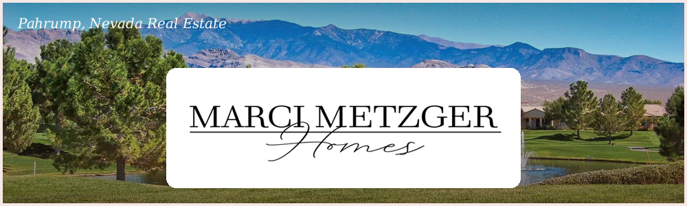

<p align="center">  
  
</p>

<h1 align="center">Marci Metzger Homes — Real Estate Landing Page</h1>

<p align="center">
  A responsive real-estate agent landing page built for a Pahrump, NV Realtor — property search filters, a photo gallery, services overview, and a contact form.
</p>

<p align="center">
  <a href="https://merci-demo.netlify.app/"></a>
  
  
  
  
</p>

<p align="center">
  <strong>🔗 Live Demo:</strong> <a href="https://merci-demo.netlify.app/">merci-demo.netlify.app</a>
</p>

---

A commissioned, single-page marketing site for a real estate agent — built to introduce the agent, showcase listings and property photos, and convert visitors into leads through a contact form and click-to-call buttons.

> **Client project note:** This site was built for a real client (Marci Metzger / The Ridge Realty Group) and is published here as a portfolio sample. Business name, branding, and contact details are public marketing information the business already uses, so — unlike the other projects in this collection — no content was removed or anonymized.

---

## 📑 Table of Contents

- [Features](#-features)
- [Project Structure](#-project-structure)
- [Sections](#-sections)
- [Tech Stack](#%EF%B8%8F-tech-stack)
- [Run Locally](#-run-locally)
- [Deployment](#-deployment)
- [License](#-license)
- [Author](#-author)

---

## ✨ Features

- 📱 Fully responsive layout, mobile-first navigation
- 🏡 Hero section with a direct **Call Now** action
- 👤 Agent bio/about section
- 🔍 Property **search & filter form** (location, type, sort, bedrooms, baths, price range) — UI/markup ready to wire up to a real listings source
- 🖼️ Interactive **photo gallery** with thumbnail navigation and fade transitions
- 🤝 Affiliations/partner logo strip (brokerage, chamber of commerce, equal housing, etc.)
- 🧰 Services overview section
- ✉️ Contact form (name, email, message)
- 🔗 Social links (Facebook, Instagram, LinkedIn, Yelp)

---

## 📂 Project Structure

```text
merci-metzger-realestate/
├── index.html          # All page sections and markup
├── styles.css           # Layout, theming, and responsive rules
├── script.js             # Gallery navigation logic
├── readme-banner.png      # README banner composited from the site's own banner photo + logo
└── images/                # Branding, listing photos, and social icons
```

---

## 🧭 Sections

<div align="center">

| Section | Purpose |
|---|---|
| Hero | Headline + click-to-call |
| About | Agent introduction and credentials |
| Get It Sold | Seller-focused pitch |
| Search Listings | Property search/filter form |
| Affiliations | Brokerage and community logos |
| Photo Gallery | Featured property photos |
| Services | What the agent offers |
| Contact | Lead-capture form |

</div>

---

## 🛠️ Tech Stack

<div align="center">

| Category | Technologies |
|:---:|:---:|
| **Markup** | Semantic HTML5 |
| **Styling** | Hand-written CSS3 (no framework) |
| **Interactivity** | Vanilla JavaScript (gallery carousel) |
| **Hosting target** | Any static host (Netlify, GitHub Pages, cPanel, etc.) |

</div>

---

## ▶️ Run Locally

This is a fully static site — no build step or dependencies required.

- Double-click `index.html` to open it directly in a browser, **or**
- Serve it locally for accurate relative-path behavior:
```bash
python -m http.server 5500
```
Then open `http://localhost:5500`.

---

## 🚀 Deployment

Since this is static HTML/CSS/JS, it can be deployed as-is to any static host:

- **Netlify / Vercel** — drag-and-drop the folder or connect the repo
- **GitHub Pages** — push to a repo and enable Pages on the `main` branch
- **Traditional hosting** — upload the folder contents via FTP/cPanel

The property search form currently submits nothing server-side — connect it to a listings API/MLS feed or a form backend (e.g., Netlify Forms, Formspree) to make it functional.

---

## 📄 License

This is a client-commissioned project shared here as a portfolio sample. Please don't reuse the client's branding, photos, or copy — the structure and code are shared for reference only.

---

## 👤 Author

**Christian G. Maranan**
Computer Engineering Student — Major in Machine Learning
at Tanauan City College

- **GitHub:** [@krei-labs](https://github.com/krei-labs)
- **Instagram:** [@krei_in](https://instagram.com/krei_in)
- **Email:** [christianmaranan0303@gmail.com](mailto:christianmaranan0303@gmail.com)

---

<p align="center"><strong>Build. Learn. Experiment.</strong> — kréi / Krei Labs</p>
